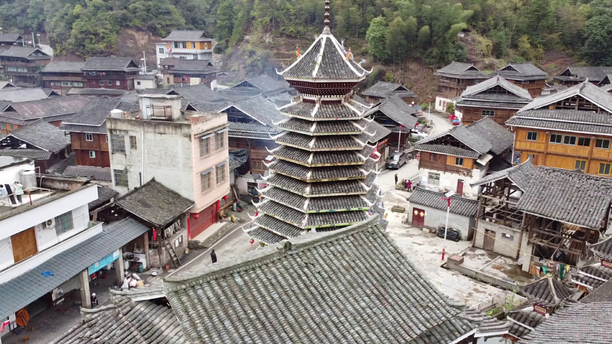
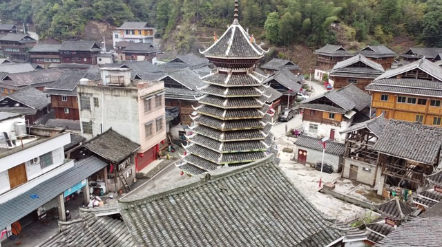
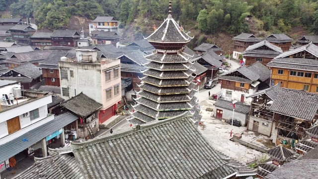
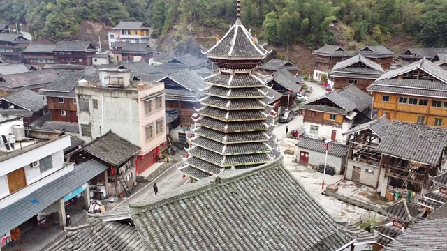

# UAV-DDT-HeritageBench

[](https://creativecommons.org/licenses/by/4.0/)
[](https://doi.org/10.5281/zenodo.21429615)

Manuscript, benchmark code, and dataset for:

> **UAV-Based Neural Reconstruction of Dong Drum Towers: A Multi-Case Benchmark for Conservation-Oriented Method Selection**
> Tao Jiaxing — *IEEE Transactions on Visualization and Computer Graphics*, 2026

<p align="center">
  
  <br>
  <em>UAV-based neural reconstruction of Dong Drum Towers — novel-view synthesis across four heritage scenes and four methods.</em>
</p>

This repository provides the **manuscript, benchmark code, and dataset** for a study evaluating UAV-based neural 3D reconstruction methods applied to Dong minority Drum Tower heritage sites in China. Four methods are compared under a unified, fairness-controlled protocol, and results are interpreted for conservation-oriented method selection.

## Overview

**Methods benchmarked** (4): NeRF, 2DGS, 3DGS, and Instant-NGP (INGP). 2DGS and 3DGS share the same COLMAP workspace and Gaussian-splatting codebase.

**Pipeline** (6 stages): UAV image acquisition → corpus construction → camera pose estimation & sparse reconstruction (COLMAP) → neural rendering/reconstruction (4 methods) → quantitative & qualitative evaluation → conservation-oriented interpretation.

**Evaluation metrics**:

| Metric | Direction | Interpretation |
|--------|-----------|----------------|
| PSNR | Higher is better | Pixel-level reconstruction fidelity |
| SSIM | Higher is better | Structural & visual consistency |
| LPIPS | Lower is better | Perceptual similarity & texture realism |
| Training time | Lower is better | Computational efficiency |
| Rendering speed (FPS) | Higher is better | Real-time visualization capability |

**Fairness control**: identical UAV image set per scene, shared SfM camera poses, common LLFF-style train/test split (every 8th frame held out), same workstation (RTX 4090), and default/recommended parameters per method.

**Scenes** (4 Dong Drum Towers):

| Key | 中文 | # images | # test views |
|-----|------|----------|--------------|
| `celi` | 则里 | 654 | 65 |
| `zhaoli` | 朝利 | 544 | 54 |
| `congjiang` | 从江 | 551 | 55 |
| `zhengchong` | 增冲 | — (frames) | 91 |

| 则里 (Celi) | 朝利 (Zhaoli) | 从江 (Congjiang) | 增冲 (Zhengchong) |
|:---:|:---:|:---:|:---:|
|  |  |  |  |

## Prerequisites

**To build the paper:**
- TeX Live 2021+ or MiKTeX (with `pdflatex`, `bibtex`)
- `make` (Linux/macOS) or a LaTeX IDE (Overleaf, TeXstudio) on Windows

**To run the benchmark:**
- CUDA-capable GPU (experiments used an NVIDIA RTX 4090, 24 GB)
- Python 3.8+, PyTorch (2DGS / 3DGS / NeRF-pytorch)
- COLMAP 3.14.0 with CUDA
- Method repos cloned locally (paths set in `code/scenes.sh`):
  `2d-gaussian-splatting`, `gaussian-splatting`, `nerf`, `instant-ngp`
- See `code/requirements.txt` for the Python environment

## Build the Paper

```bash
cd paper
make            # compile PDF (pdflatex + bibtex)
make clean      # remove auxiliary files
make cleanall   # remove all generated files including PDF
make view       # compile and open PDF (Windows / macOS / Linux)
```

Or manually:
```bash
pdflatex main
bibtex main
pdflatex main
pdflatex main
```

## Repository Structure

```
UAV-DDT-HeritageBench/
├── paper/                  # LaTeX manuscript
│   ├── sections/           # Per-section .tex files
│   │   ├── abstract.tex
│   │   ├── introduction.tex
│   │   ├── research_background.tex
│   │   ├── study_objects.tex
│   │   ├── method.tex
│   │   ├── analysis.tex
│   │   └── conclusion.tex
│   ├── figures/media/      # All paper figures (image1.png … image14.png)
│   ├── main.tex            # Main LaTeX entry file
│   ├── references.bib      # BibTeX references
│   ├── IEEEtran.cls        # IEEE journal document class
│   ├── IEEEtran.bst        # IEEE BibTeX style
│   └── Makefile            # Build automation
│
├── code/                   # Benchmark code
│   ├── scenes.sh           # Shared scene→dir mapping & repo paths
│   ├── preprocess/
│   │   └── extract_frames.py   # UAV video → frame_XXXXXX.jpg (+ blur screen)
│   ├── colmap/
│   │   └── run_sfm.sh      # SfM pose estimation (COLMAP 3.14.0, CUDA)
│   ├── methods/            # Per-method training wrappers
│   │   ├── nerf/train.sh   # bmild/nerf-pytorch (blender, factor 8)
│   │   ├── 2dgs/train.sh   # hbb1/2d-gaussian-splatting (30k, sh=3)
│   │   ├── 3dgs/train.sh   # graphdeco-inria/gaussian-splatting (30k)
│   │   └── ingp/train.sh   # Instant-NGP (50k steps, hash encoding)
│   ├── eval/
│   │   └── metrics.py      # PSNR / SSIM / LPIPS over test views
│   └── requirements.txt    # Python environment
│
├── data/                   # Dataset (see Data Availability)
│   ├── <scene>/images/     # UAV frames (frame_XXXXXX.jpg)
│   ├── <scene>/{2dgs,nerf,ingp}/  # Per-method COLMAP + transforms
│   └── splits/             # Test image lists per scene (LLFF hold=8)
│
├── supplementary/          # Reconstruction result videos (*.mp4)
├── CITATION.cff            # Citation metadata
├── .gitignore              # Ignores build artifacts & large data
├── LICENSE                 # CC-BY-4.0
└── README.md
```

## Reproducing the Benchmark

**Hardware/software used**: NVIDIA RTX 4090 (24 GB), COLMAP 3.14.0 (CUDA), PyTorch (2DGS/3DGS), TensorFlow 2.x (NeRF), Instant-NGP v2.0dev.

Scene keys: `celi` · `zhaoli` · `congjiang` · `zhengchong` (or `all`).
Edit `code/scenes.sh` to point `DATA_ROOT` / `OUTPUT_ROOT` / repo paths at your machine.

```bash
# 1. Set up Python environment
cd code
pip install -r requirements.txt

# 2. (Optional) Extract frames from a UAV video
python preprocess/extract_frames.py --video celi.mp4 --out ../data/则里/images

# 3. Camera pose estimation with COLMAP (shared by 2DGS & 3DGS)
bash colmap/run_sfm.sh celi        # or: bash colmap/run_sfm.sh all

# 4. Train each method
bash methods/2dgs/train.sh celi    # 30k iters, sh_degree 3
bash methods/3dgs/train.sh celi    # 30k iters (reuses 2DGS COLMAP)
bash methods/nerf/train.sh  celi   # blender type, factor 8
bash methods/ingp/train.sh  celi   # 50k steps, hash encoding

# 5. Evaluate — PSNR / SSIM / LPIPS across all scenes & methods
python eval/metrics.py --scene all --method all
# Results saved to <OUTPUT_ROOT>/results_summary.csv
```

> **Note on 3DGS**: at repo assembly time only 2DGS / NeRF / INGP outputs existed on the training server. `methods/3dgs/train.sh` reproduces 3DGS from the same COLMAP inputs used by 2DGS — run it to complete the four-method benchmark.

## Qualitative Results

Novel-view renderings on **则里 (Celi)**, held-out test view:

| Ground Truth | NeRF | 2DGS | 3DGS | INGP |
|:---:|:---:|:---:|:---:|:---:|
|  |  |  |  |  |

Renderings are exported from `<OUTPUT_ROOT>/<scene>/<method>/test/ours_*/renders/`. See the paper for full quantitative comparisons across all four scenes.

## Data Availability

The UAV image corpus, COLMAP sparse reconstructions, and train/test splits are archived on Zenodo (see [Citation](#citation)). Download and extract into `data/` following the structure above. Large binaries (raw images, checkpoints) are excluded from git via `.gitignore`.

## Related Repositories

| Repository | Description |
|------------|-------------|
| [3DGS-Survey](https://github.com/autumn119/3DGS-Survey) | Project page (GitHub Pages) |
| [UAV-DDT-HeritageBench](https://github.com/autumn119/UAV-DDT-HeritageBench) | Benchmark code & data (this repo) |

## Citation

If you use this work, please cite:

```bibtex
@article{tao2026_dong_drum_tower,
  author  = {Tao, Jiaxing},
  title   = {UAV-Based Neural Reconstruction of Dong Drum Towers: A Multi-Case Benchmark for Conservation-Oriented Method Selection},
  journal = {IEEE Transactions on Visualization and Computer Graphics},
  year    = {2026}
}
```

The archived dataset can be cited as:

```bibtex
@dataset{tao2026_dong_drum_tower_dataset,
  author    = {Tao, Jiaxing},
  title     = {UAV-DDT-HeritageBench: UAV Imagery and COLMAP Reconstructions of Dong Drum Towers},
  year      = {2026},
  publisher = {Zenodo},
  doi       = {10.5281/zenodo.21429615},
  url       = {https://doi.org/10.5281/zenodo.21429615}
}
```

## License

This work is licensed under **CC-BY-4.0**. See [LICENSE](LICENSE) for details.


